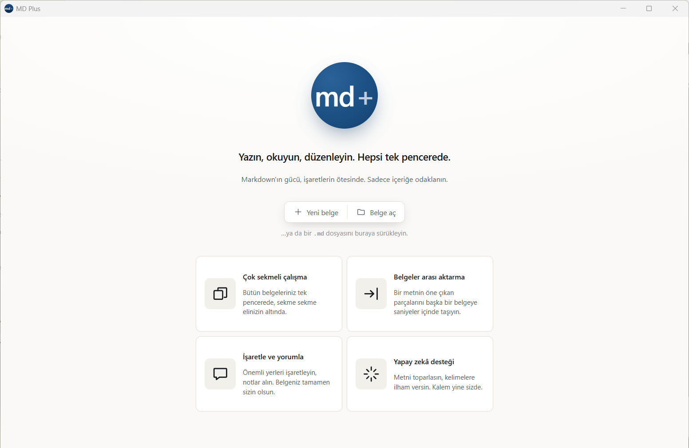
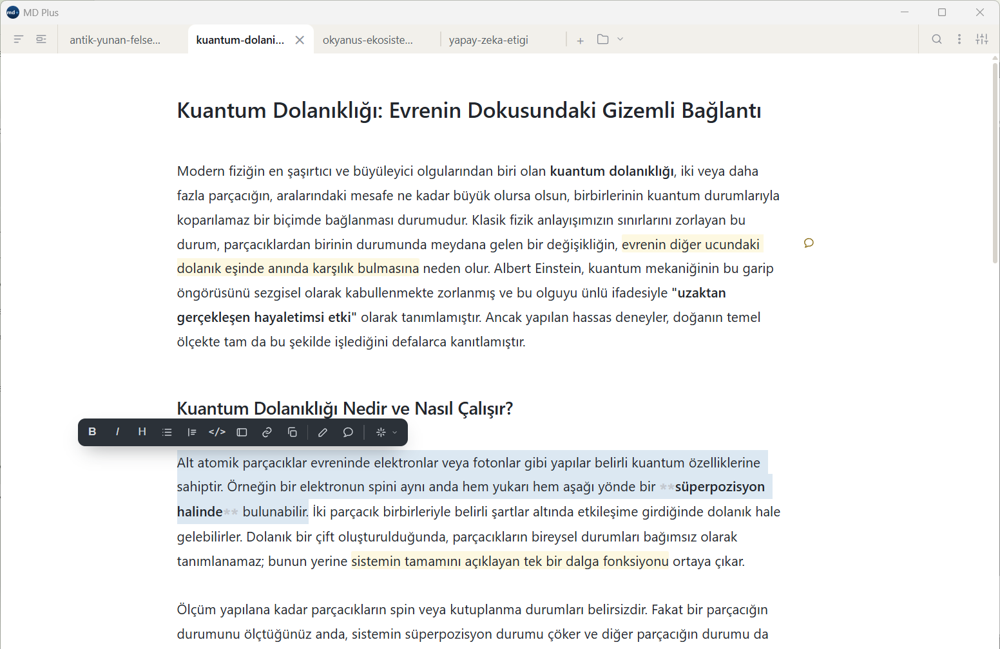
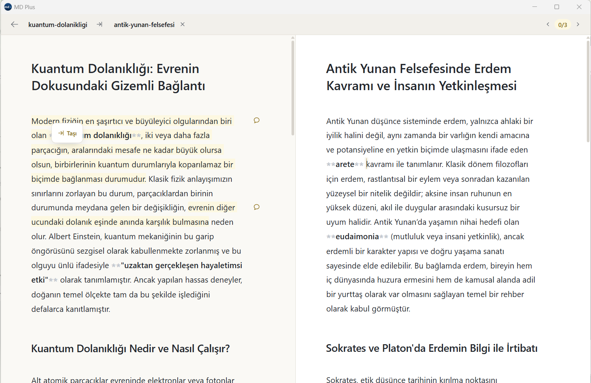
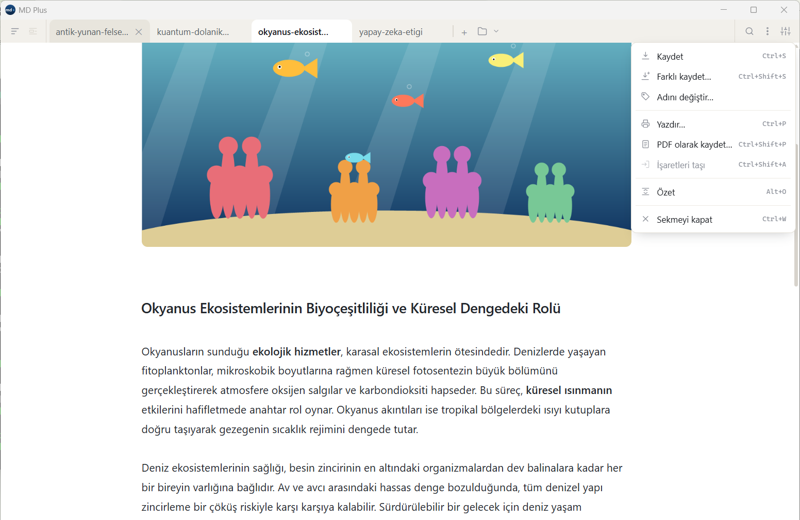

<div align="center">

# MD Plus

### Yazın, okuyun, düzenleyin. Hepsi tek pencerede.

Markdown'ın gücü, işaretlerin ötesinde. Sadece içeriğe odaklanın.

**[English](README.en.md)** · Türkçe

</div>



MD Plus, birden çok `.md` dosyasını sekmelerde açan bir masaüstü Markdown
uygulamasıdır. Her sekme hem okunur hem yazılır; yazma yüzeyi **yerinde
biçimlendirmedir**: kalın yazınca kalın görünür, ham işaretler yalnız imleç o
satırdayken belirir. Ayrı bir önizleme kipi yoktur, çünkü gerek yoktur.

---

## Dört temel

### Çok sekmeli çalışma

Bütün belgeleriniz tek pencerede, sekme sekme elinizin altında. Sekmeler
sürükle-bırak sıralanır ve otomatik kaydedilir; kayıt önce geçici bir dosyaya
yazılıp yerine taşınır, yani yarıda kalmış bir yazma belgenize dokunamaz.
Biçim, metni seçince açılan **yüzen paletten** ve kısayollardan verilir: kalın,
italik, başlık, liste, alıntı, kod, callout, görsel, link.



### Belgeler arası aktarma

Bir metnin öne çıkan parçalarını başka bir belgeye saniyeler içinde taşıyın.
**Aktarma** ekranı sekmelerin üstünde tam bir katman açar: solda kaynak, sağda
hedef. İşaretler arasında dolaşır (`‹ n/m ›`), seçtiğiniz parçayı işaretin
yanındaki **Taşı** ile hedef belgeye gönderirsiniz. Aynı parçayı istediğiniz
kadar tekrar gönderebilirsiniz.



### İşaretle ve yorumla

Önemli yerleri işaretleyin, notlar alın. Belgeniz tamamen sizin olsun.
İşaretler ve yorumlar belgenin akışını bozmaz, sağdaki rozetle hizalanır; kaynak
dosya dışarıdan değişse bile işaretler kendini yeniden bağlamaya çalışır.

### Yapay zekâ desteği

Metni toparlasın, kelimelere ilham versin. Kalem yine sizde. İsteğe bağlı yapay
zekâ katmanı belge menüsünden ve paletten çalışır; **çıktı, işlediğiniz metnin
dilinde gelir** — İngilizce bir paragraf seçerseniz İngilizce, Türkçe seçerseniz
Türkçe. İşler:

- **Akıcı alternatif** — aynı içeriği daha akıcı yazar (sayı, ad, formül korunur).
- **Tamamlayıcı paragraf** — metni yazarın ağzından ilerletir.
- **Yazım ve noktalama** — yalnız yazımı düzeltir, kelimeyi değiştirmez.
- **Bilgi denetimi** ve **kaynak önerisi** — yalnız okunur; belgeye giremez.
- **Özet** — belgeyi ya da seçimi madde madde özetler.

Çoklu sağlayıcı: Gemini, Claude, OpenAI, OpenRouter, NVIDIA, Groq, DeepSeek,
yerel Ollama ve herhangi bir OpenAI-uyumlu servis (kendi adresinizi girerek).
Varsayılan **kapalı** — hiçbir model bağlı değilken uygulama tam olarak yapay
zekâsız hâlidir.



---

## Dahası

- **Görsel** — panodan yapıştırın ya da sürükleyin; belgenin yanındaki
  `gorseller/` klasörüne kopyalanır, satır içinde gösterilir.
- **Formül** — `$...$` ile yazılan LaTeX, KaTeX ile dizilir.
- **PDF ve yazdırma** — belge tek parça basılır; işaret ve yorumlar çıktıya girmez.
- **Bul ve değiştir** — belge içi arama (`Ctrl+F`) ve değiştirme (`Ctrl+H`),
  Türkçe'ye doğru büyük/küçük harf katlamasıyla.
- **Gömülü belge** — bir `.md` linkinin içeriğini yerinde, salt okunur açar.
- **Son açılanlar**, **içindekiler**, link takibi ve geri dönüş.

## İki dil

Arayüz **Türkçe ve İngilizce**. Açılışta işletim sisteminizin diline uyar,
Ayarlar'dan değiştirilir. Yapay zekâ çıktısı ise arayüzden bağımsız olarak
**metnin diline** göre gelir.

## Yığın

[Tauri 2](https://tauri.app/) (Rust kabuk) + [Vite](https://vitejs.dev/) +
[CodeMirror 6](https://codemirror.net/) + [KaTeX](https://katex.org/) +
[marked](https://marked.js.org/). Bağımsız `.exe` ~12 MB.

## Geliştirme

```bash
npm install
npm run app        # geliştirme (canlı yenileme)
npm run app:build  # bağımsız exe + MSI (src-tauri/target/release/)
npm test           # birim sınavları
```

## Nasıl üretildi

Bu proje **vibe coding** ile yazıldı: ürün fikri, tasarım kararları, isterler ve
yön tamamen **repo sahibine (Zafer Kılıç)** aittir; **kodun tamamı yapay zekâ
tarafından** onun yönlendirmesiyle yazılmıştır. Yani insan neyi ve nasıl
istediğini belirledi, kodu makine yazdı.

## Lisans

[MIT](LICENSE) © Zafer Kılıç
