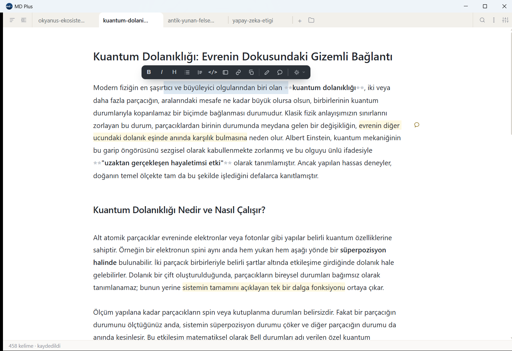
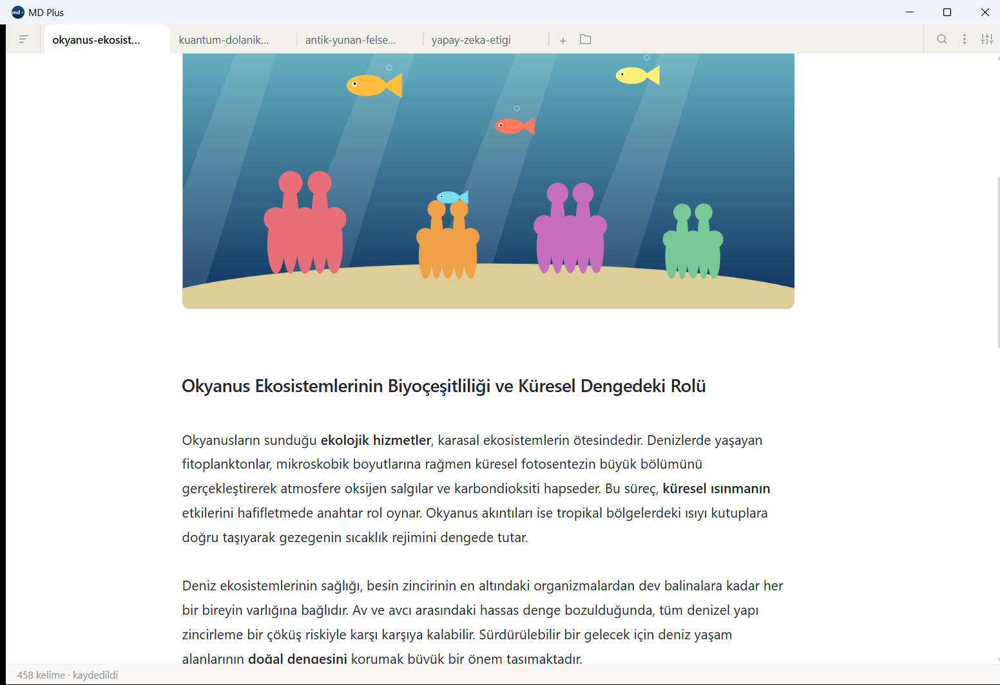

# MD Plus

Çevrimdışı bir masaüstü **Markdown okuyucu ve yazıcı**. Birden çok `.md` dosyasını
sekmelerde açar; her sekme hem okunur hem yazılır. Yazma yüzeyi **yerinde
biçimlendirmedir**: kalın yazınca kalın görünür, ham işaretler yalnız imleç o
satırdayken belirir — ayrı bir önizleme kipi yoktur.


## Öne çıkanlar

- **Çok sekmeli okuma/yazma.** Sürükle-bırak sıralanan sekmeler; otomatik kayıt
  ve `.bak` yedeği. Biçim, metni seçince açılan yüzen paletten ve kısayollardan
  verilir: kalın, italik, başlık, liste, alıntı, kod, callout, görsel, link.
- **Aktarma.** Belgeler arasında parça taşımak için tam katman: işaretler
  arasında dolaş, seçtiğin parçayı bir hedef belgeye gönder.
- **İşaretler ve yorumlar.** Metnin üstüne işaret koy, not düş. Bunlar `.md`
  dosyasının **içine yazılmaz** — belgenin yanındaki yan kayıtta yaşar; dosya
  her yerde temiz açılır.
- **Yapay zekâ katmanı.** Özet, yeniden yazma gibi işler için çoklu sağlayıcı
  desteği (OpenAI uyumlu, Gemini, Anthropic, Ollama). Tümü isteğe bağlı.
- **Çevrimdışı PDF çıktısı.** İşaret ve yorumlar PDF'e girmez.
- **Formül desteği.** KaTeX ile matematiksel gösterim.

## Ekranlar

Metni seçince çıkan **yüzen palet** — biçim, işaretleme, yorum ve yapay zekâ, hepsi tek yerde:



**Aktarma** katmanı — solda kaynak, sağda hedef; işaretin yanındaki **Taşı** ile seçtiğin parçayı hedef belgeye gönderirsin:


Görseller belgenin yanındaki `gorseller/` klasörüne kopyalanır ve satır içinde gösterilir; formüller KaTeX ile dizilir:



## Taşınabilirlik ilkesi

Yazılan her biçim standart Markdown'dır; uygulamaya özel hiçbir şey `.md`nin
içine sızmaz. Renkli kutular `> [!NOTE]` gibi **callout**'larla, görseller
`gorseller/` klasörüne kopyalanıp standart `` linkiyle
verilir. Base64 gömme ve gömülü HTML yoktur. Dosya, her Markdown düzenleyicide
aynı şekilde açılır.

## Yığın

[Tauri 2](https://tauri.app/) (Rust kabuk) + [Vite](https://vitejs.dev/) +
[CodeMirror 6](https://codemirror.net/) + [KaTeX](https://katex.org/) +
[marked](https://marked.js.org/). Bağımsız `.exe` ~12 MB.

## Geliştirme

```bash
npm install
npm run app        # geliştirme (canlı yenileme)
npm run app:build  # bağımsız exe + MSI (src-tauri/target/release/)
npm test           # birim sınavları
```

## Nasıl üretildi

Bu proje **vibe coding** ile yazıldı: ürün fikri, tasarım kararları, isterler ve
yön tamamen **repo sahibine (Zafer Kılıç)** aittir; **kodun tamamı yapay zekâ
tarafından** onun yönlendirmesiyle yazılmıştır. Yani insan neyi ve nasıl
istediğini belirledi, kodu makine yazdı.

## Lisans

[MIT](LICENSE) © Zafer Kılıç
